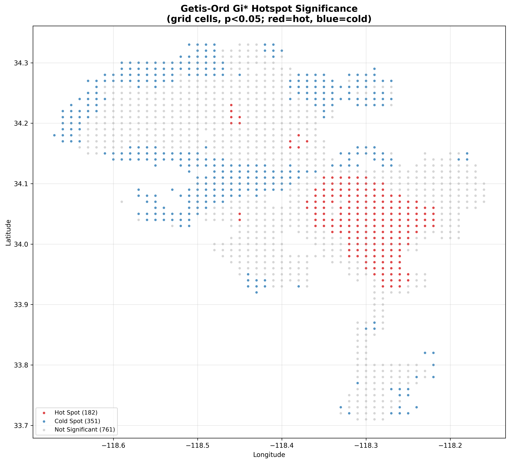
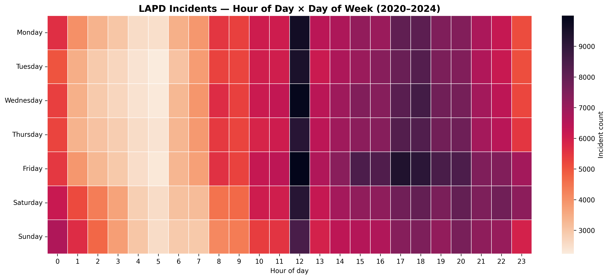
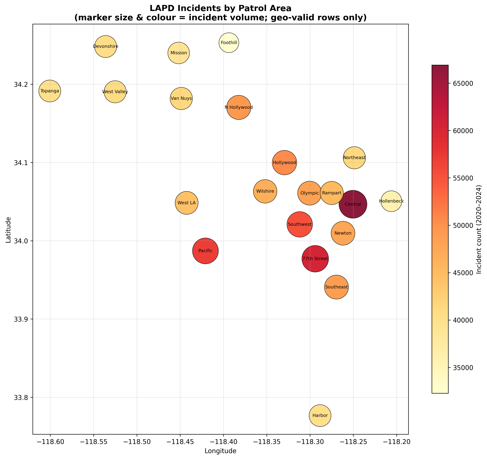
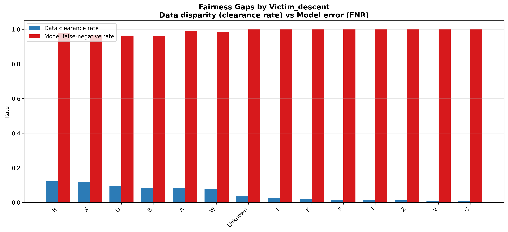
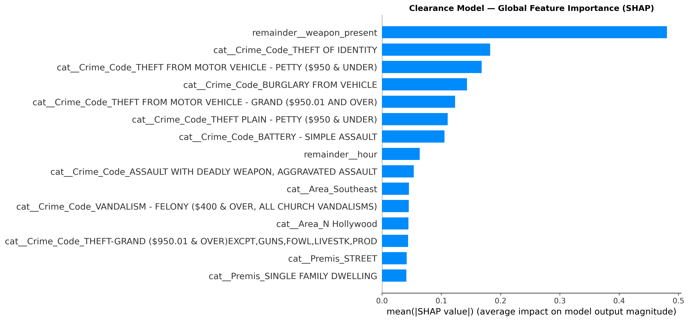

# LAPD Crime: Spatiotemporal Hotspot Analysis & a Fairness Audit of Case Clearance

> **A descriptive, responsible-ML study of ~974k LAPD incidents (2020 – Aug 2024).** It maps *where and when* crime concentrates using formal spatial statistics, and *audits* a case-clearance model for demographic disparities. **This is not predictive policing** — no model here directs officers to people or places.

[]()
[]()
[]()

---

## TL;DR

Two complementary halves, deliberately scoped:

1. **Spatiotemporal hotspots (descriptive / operational).** Temporal patterns (hour × day-of-week) plus a **formal Getis-Ord Gi\*** hotspot statistic on a ~1.1 km spatial grid — statistically significant hot/cold clusters, not just "lots of dots."
2. **Case-clearance fairness audit (responsible ML).** A transparent clearance classifier trained on **operational features only** (victim demographics deliberately excluded as inputs), then **audited** with Fairlearn across victim descent, sex, and age band — separating *disparity already present in the data* from *disparity introduced by the model*.

Validated end-to-end on the real CSV: **974,477 rows | 131 impossible ages nulled | 2,262 phantom (0,0) coords excluded from mapping | clearance model AUC 0.804**.

---

## Scope & Ethics

**What this project does:**
- Describes historical incident concentration in space and time for resource/operational context.
- Audits a clearance-prediction model for demographic disparities, as a transparency exercise.
- Surfaces data-quality problems honestly rather than hiding them.

**What this project deliberately does *not* do:**
- It does **not** forecast crime to direct patrols to individuals or neighborhoods.
- It does **not** use victim demographics as model inputs.
- It does **not** recommend deploying the clearance model operationally — the model exists to be *audited*.

**Why the caution.** Predictive-policing systems are known to create **feedback loops** (past enforcement concentrated in certain areas generates more recorded incidents there, which then justifies more enforcement) and to **amplify historical bias** present in the training data. Recorded-crime data reflects *reporting and enforcement patterns*, not ground-truth offending. A clearance audit can only describe disparities in *recorded outcomes*; it cannot distinguish their many possible causes. Treat every number here as a description of an administrative dataset, not of reality.

---

## Data-Honesty Note

Real artifacts found in `Crime_Data_from_2020_to_Present.csv` and exactly how each was handled (all counts verified against the raw file):

| Issue | Found | Handling |
|---|---|---|
| **Impossible victim ages** | `Victim_age` ranges **−4 to 120**; **131** rows < 0 or > 100 | Nulled (not averaged over); age band → explicit `Unknown` |
| **Phantom coordinates** | **2,262** rows at exactly `(0.0, 0.0)` — missing coords that map into the ocean off West Africa, not a real place | Flagged `geo_valid=False`, **excluded from all geospatial steps**, kept for non-spatial counts; **972,215** geo-valid rows mapped |
| **Heavy missingness** | `Weapon` **66.6%** null, `Victim_sex` / `Victim_descent` **14.0%** null | **Not imputed.** Missing sensitive fields become an explicit `Unknown` category; a `weapon_present` flag is derived |
| **Two date formats** | `Date_occured` mixes `%m/%d/%y` and `%m/%d/%Y`; time of day lives separately in `Time_occured` as an HHMM integer | Rebuild `HH:MM`, combine, parse with `format="mixed"` → **0 unparsed datetimes** |
| **Clearance target** | `Status` ∈ {Invest Cont, Adult Other, Adult Arrest, Juv Arrest, Juv Other, UNK} | `is_cleared = 1` **iff** status ∈ {Adult Arrest, Juv Arrest}. "Other" dispositions are **not** arrests → not cleared. Base clearance rate **9.01%** |

> A naive pipeline would average over −4-year-old victims and plot 2,262 crimes in the Atlantic. Surfacing and handling these is treated as a feature, not a footnote.

---

## Architecture

```
Load & Clean ─► Spatiotemporal Hotspots ─► Maps
             └► Train Clearance Model ─► Fairness Audit ─► Visualizations ─► Summary
```

**Cleaning (`src/data_processor.py`)** — datetime reconstruction, age validation, phantom-coordinate flagging, explicit-`Unknown` encoding, clearance-target derivation, missingness report, parquet persistence.

**Hotspots (`src/hotspots.py`)** — temporal aggregations + hour×DOW matrix; incidents aggregated to a rounded lat/lon grid (~1.1 km cells); **Getis-Ord Gi\*** via `esda.G_Local` over a `libpysal` `DistanceBand` (star=True, 99 permutations) → each cell classified Hot / Cold / Not-Significant at p<0.05. Gi\* uses permutation-based inference, so the exact significant-cluster count varies by a few cells between runs — this is expected and reported honestly.

**Mapping (`src/mapping.py`)** — interactive Folium map (HeatMap layer + per-area incident circles + layer control) and a static 300 dpi area choropleth. The raw file ships no polygon geometries, so patrol areas are rendered at their incident centroid sized/coloured by volume rather than fabricating boundaries.

**Fairness audit (`src/fairness_audit.py`)** — LightGBM clearance classifier on **operational features only** (`Area`, `Crime_Code`, `Premis`, `hour`, `weapon_present`). Audited groups: `Victim_descent`, `Victim_sex`, `age_band`. We report, per group: **raw clearance rate** (data disparity) vs **model selection rate / FNR / TPR** (model disparity), plus **demographic-parity difference**, **equalized-odds difference**, and the **FNR gap**. SHAP gives global feature importance.

---

## Results

> Numbers below are from the validated end-to-end run on the real dataset. Hotspot counts are permutation-based and move by a few cells per run.

### Top hotspot grid cells (Getis-Ord Gi\*, p<0.05)

| Cell (lat, lon) | Incidents | Gi\* z-score | p |
|---|---|---|---|
| (34.05, −118.26) | 13,138 | 5.20 | 0.01 |
| (34.05, −118.27) | 4,645 | 4.95 | 0.01 |
| (34.05, −118.25) | 12,481 | 4.92 | 0.01 |
| (34.04, −118.26) | 7,552 | 4.65 | 0.01 |
| (34.04, −118.25) | 8,223 | 4.39 | 0.01 |

Roughly **~180 significant hot cells** and **~350 cold cells** out of 1,294 grid cells; peak activity at **hour 12, Fridays**.

**Getis-Ord Gi\* hotspot significance** (red = statistically significant hot, blue = cold):



**Temporal pattern — hour of day × day of week:**



**Incidents by patrol area** (marker size & colour = volume; geo-valid rows only):



> An interactive Folium version (heatmap layer + per-area circles) is generated at `reports/maps/crime_heatmap.html` — open it in a browser.

### Fairness audit — clearance by victim descent (data vs model)

| Descent | n | Data clearance rate | Model selection rate | Model FNR |
|---|---|---|---|---|
| H | 291,256 | 12.2% | 0.5% | 0.976 |
| X | 101,620 | 12.0% | 0.5% | 0.970 |
| O | 76,222 | 9.4% | 0.5% | 0.964 |
| B | 133,656 | 8.5% | 0.6% | 0.961 |
| W | 195,759 | 7.6% | 0.2% | 0.983 |
| Unknown | 136,015 | 3.5% | 0.0% | 1.000 |

**Headline gaps (data disparity → model behavior):**

| Audited attribute | Data clearance-rate gap | Demographic-parity diff | Equalized-odds diff |
|---|---|---|---|
| Victim descent | **11.6 pp** | 0.006 | 0.039 |
| Victim sex | **8.4 pp** | 0.006 | 0.033 |
| Age band | **7.9 pp** | 0.005 | 0.028 |

**Fairness gaps by victim descent** — data disparity (clearance rate) vs model error (FNR):



**How to read this honestly.** There is a large **disparity already in the data** (an 11.6-point clearance-rate gap across descent groups). The model's *demographic-parity* and *equalized-odds* differences are small — but that is partly because the very low 9% base rate at a 0.5 threshold makes the model predict "not cleared" almost everywhere, driving **false-negative rates near 0.97–1.0 across all groups**. In other words: the model barely separates the classes, so it is "fair" mostly by being uniformly pessimistic. This is exactly the kind of artifact an audit is meant to surface — small group-disparity metrics do **not** mean the underlying process is equitable.

**What actually drives the model (SHAP global importance):**



All figures live in `reports/figures/` and the interactive map at `reports/maps/crime_heatmap.html`.

---

## Project Structure

```
lapd-crime-hotspots-fairness/
├── data/
│   ├── raw/                     # place Crime_Data_from_2020_to_Present.csv here
│   │   └── Crime_Data_from_2020_to_Present.csv
│   └── processed/
│       └── crime_clean.parquet  # generated
├── src/
│   ├── __init__.py
│   ├── data_processor.py        # load, clean, datetime, target, missingness report
│   ├── hotspots.py              # temporal + Getis-Ord Gi* spatial statistics
│   ├── mapping.py               # Folium interactive + static choropleth
│   ├── fairness_audit.py        # clearance model + Fairlearn + SHAP
│   └── visualize.py             # 300dpi report figures
├── reports/
│   ├── figures/                 # temporal_heatmap, hotspot_significance,
│   │                            #   fairness_gaps, clearance_shap, area_choropleth (.png)
│   ├── maps/                    # crime_heatmap.html
│   └── metrics/                 # hotspots.csv, crime_by_area.csv, fairness_audit.csv
├── config.yaml                  # paths, status→clearance mapping, analysis params
├── main.py                      # pipeline orchestrator
├── requirements.txt
└── README.md
```

---

## Installation

```bash
git clone https://github.com/MelihOrel/lapd-crime-hotspots-fairness.git
cd lapd-crime-hotspots-fairness

python -m venv .venv
source .venv/bin/activate          # Windows: .venv\Scripts\activate

pip install -r requirements.txt
```

> The geospatial stack (`geopandas` / `libpysal` / `esda`) is the version-sensitive part. If wheels fail to build on your platform, install those three via conda-forge first, then `pip install -r requirements.txt` for the rest.

Place `Crime_Data_from_2020_to_Present.csv` in `data/raw/`.

---

## Usage

```bash
python main.py --config config.yaml
```

Expected terminal output (abridged):

```
STEP 1/6 — LOAD & CLEAN (with data-quality report)
Loaded 974,477 rows x 15 cols
Nulled 131 impossible victim ages (outside [0, 100])
Flagged 2,262 phantom (0,0) coords + 0 out-of-region; 972,215 geo-valid rows kept for mapping
Derived is_cleared: 87,810 cleared (9.01%) using statuses ['Adult Arrest', 'Juv Arrest']
DATA-QUALITY REPORT
  Rows loaded                : 974,477
  Impossible ages nulled     : 131
  Phantom (0,0) coords flagged: 2,262
  Geo-valid rows (for maps)  : 972,215
  Cleared incidents          : 87,810 (9.01%)
  Missingness: {'Weapon': '66.6%', 'Victim_sex': '14.0%', 'Victim_descent': '14.0%'}

STEP 2/6 — SPATIOTEMPORAL HOTSPOT ANALYSIS
Temporal: peak hour=12, peak day=Friday
Gi*: 1,294 grid cells | 182 significant hot spots, 351 cold spots (p<0.05)

STEP 4/6 — TRAIN CLEARANCE MODEL & RUN FAIRNESS AUDIT
Clearance model AUC: 0.804
Fairness [Victim_descent]: data clearance-rate gap of 11.6 pp between highest/lowest groups | DPD=0.006 | EOD=0.039
Fairness [Victim_sex]:     data clearance-rate gap of  8.4 pp | DPD=0.006 | EOD=0.033
Fairness [age_band]:       data clearance-rate gap of  7.9 pp | DPD=0.005 | EOD=0.028

STEP 6/6 — PIPELINE COMPLETE — SUMMARY
Clearance model AUC      : 0.804
Gi* hot / cold spots     : 182 / 351
Done.
```

Runtime: a few minutes end-to-end on a laptop (the SHAP step is the slowest).

---

## License

MIT. The dataset is published by the City of Los Angeles; review its terms before redistribution.

## Disclaimer

This is a portfolio / educational project on an administrative dataset that reflects reporting and enforcement patterns, not ground-truth crime. Nothing here should be used to make operational policing decisions about any person or place.
